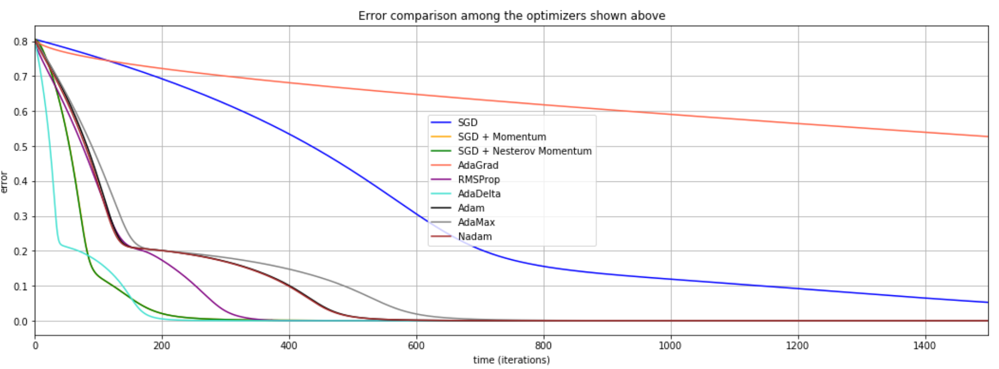
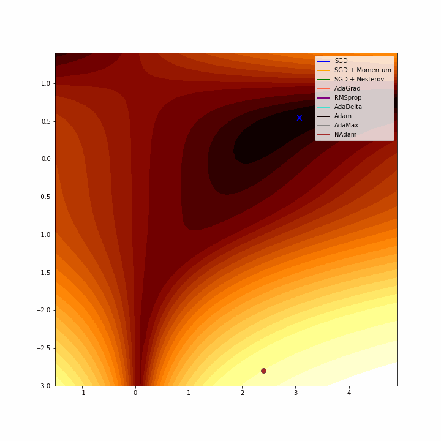

# Deep Learning optimizers study

## Introduction and objectives
The objective of this repository is to summarize the study I did for deeply understanding the most common neural networks oprimizers. In it, you will find implementations from scratch for the following gradient-based optimization algorithms.

- **Gradient Descent**
- **Gradient Descent with Momentum**
- **Gradient Descent with Nesterov Momentum**
- **AdaGrad**
- **RMSProp**
- **AdaDelta**
- **Adam**
- **AdaMax**
- **NAdam**

These implementations have been done using **numpy** and **autograd**.

## Getting started
If you are interested in reproducing the results of the study, please clone the repository, open the Report.ipynb notebook and follow it sequentially. I encourage you to try to experiment with a new objective function and to play with the parameters of the algorithms. 

You will need to have installed the following libraries.
- numpy
- autograd
- matplotlib

## Results
In the following charts you can see how the implemented algorithms behave when applied in the *log-Beale* objective function.

## Further work and contribution opportunities
There are several ways of continuing this study.
- Research and implement state-of-the-art optimization algorithms
- Implement more objective functions and show which are the potential benefits and disadvantages of each of the algorithms in each objective function
- Try to understand better why algorithms like *RMSProp* show an oscilation when they converge

If you want to continue with it, please, consider sending a pull request, I'll be more than happy to merge your changes.

## License
...